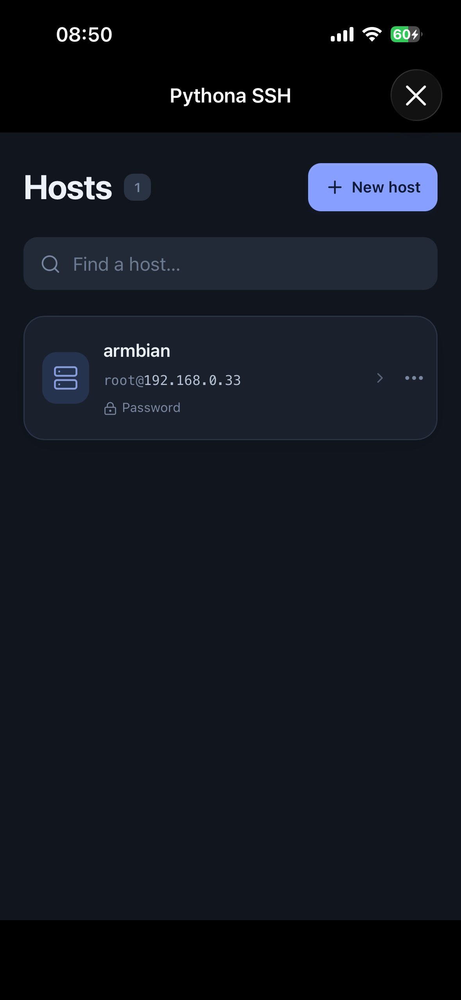
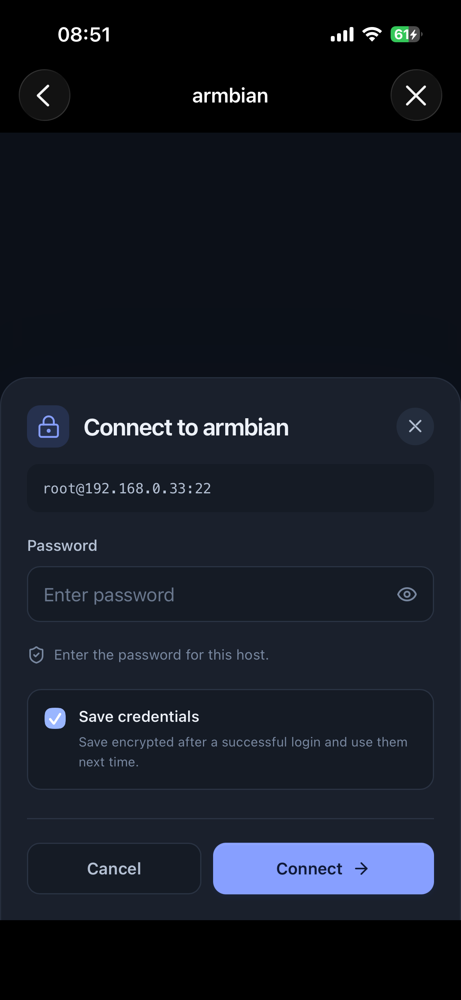
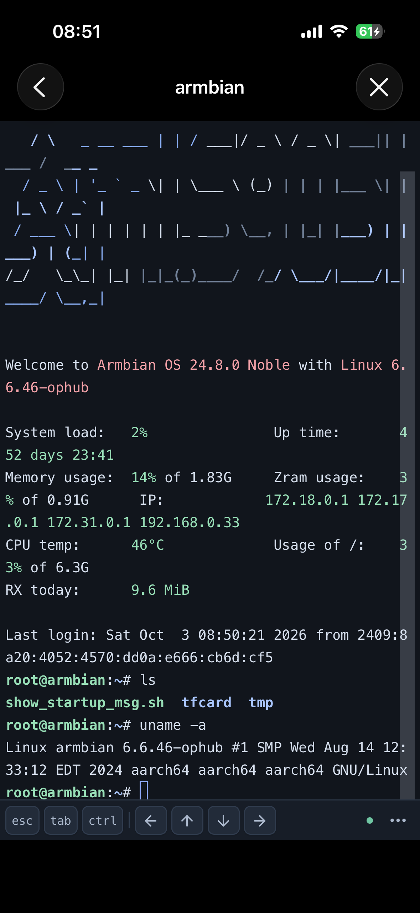

# Pythona SSH

An SSH client for [Pythona](https://pythona.app). Run `main.py` to open a
React interface in WKWebView, with Paramiko handling SSH on Python worker threads.

## Screenshots

| Hosts | Connection | Terminal |
| :---: | :---: | :---: |
| <a href="docs/screenshots/hosts.png"></a> | <a href="docs/screenshots/connect.png"></a> | <a href="docs/screenshots/terminal.png"></a> |

## Run in Pythona

1. Copy or clone the complete project into Pythona, including `frontend/dist/`.
2. Run **`main.py`** from the project root.
3. If Paramiko is missing, choose **Install Paramiko**, review the confirmation,
   then choose **Confirm installation**. The app calls
   `pythona.packages.install("paramiko", version="5.0.0")` on a background worker.
   Pythona resolves dependencies and reuses its bundled native libraries.
4. Add a host with its address, port, username and authentication method.
5. Tap a host to open its terminal. Enter a password, or choose/paste a private key
   and optional passphrase. **Save credentials** is enabled by default; after a
   successful login, subsequent connections use the saved credentials automatically.
6. Verify the server fingerprint on the first connection, then trust it to proceed.

The project includes its compiled frontend, so running it in Pythona needs no
Node.js or frontend build step. Python dependencies are installed through
Pythona after confirmation; their source is not copied into this repository.

Use a current Pythona build containing the native SSH dependencies, including
cryptography, bcrypt and PyNaCl. The current Pythona simulator bundle lacks the
complete cryptography implementation; use a physical device for SSH integration.
Installing pure Python packages cannot supply missing iOS native libraries.

## First version

- Saved host profiles, with password and RSA/ECDSA/Ed25519 private-key authentication.
- Explicit first-use host-key confirmation and rejection of changed keys.
- One interactive `xterm-256color` session, Unicode output and PTY resizing.
- Esc, Tab, Ctrl and arrow keys; selection copy, paste and font-size controls.
- A host-list home page and a separate terminal page, both using a fixed dark appearance.
- Saved credentials with Fernet encryption, plus change/forget actions on each host.
- English, Simplified Chinese and Traditional Chinese, following Pythona's language.
- Explicit disconnect and reconnect. Closing the window closes its SSH session.

The Ctrl button applies to the next character. Reconnecting opens a new remote
shell. iOS may suspend the process in the background; this is not a persistent
background service. SFTP, multiple sessions and port forwarding are future work.

Returning to the host list keeps the active session and terminal output. Tap that
host again to return to it. The terminal uses the native navigation bar on iOS and
one compact key bar; copy, paste, font size and disconnect are in its options menu.

## Project layout

```text
main.py                         Pythona entry point and browser preview
ssh_app/
  ui.py                         UIKit container, lifecycle and JSON bridge
  app.py                        Profile/session commands and confirmed installation
  session.py                    Paramiko, host verification and bounded data flow
  storage.py                    Atomic profile and encrypted credential storage
  credentials.py                Fernet encryption with a fixed application key
  page.py                       Offline HTML loading and native bootstrap
  preview.py                    Loopback-only static preview server
frontend/
  src/components/               Forms, confirmation dialogs and xterm.js terminal
  src/bridge.ts                 Native request/event transport
  src/preview.ts                In-memory browser demo adapter
  src/i18n.ts                   Product strings
  dist/index.html               Checked-in single-file production build
  tests/                        Browser integration tests
tests/                          Python integration tests and iOS smoke test
.local/                         Runtime host profiles and trusted host keys (ignored)
```

Frontend source and the Python backend stay separate. Vite compiles React,
TypeScript, CSS and xterm.js into one offline HTML file. UIKit owns presentation,
the page title, native back/close buttons and the keyboard-sized viewport. React owns the
application layout. No local HTTP server is used by the iOS interface.

## Develop the frontend

Use Node.js 22.12+ or a newer supported Node version.

```sh
cd frontend
npm ci
npm run dev
```

The browser adapter provides temporary sample hosts and a simulated shell. Try
`help`, `pwd`, `ls`, `echo hello`, Ctrl-C and `exit`. It never opens a real SSH
connection or exposes a Python command API. Its simulated profiles and credentials
stay in memory and reset on reload. Use `?lang=zh-Hans` or `?lang=zh-Hant` in Vite for localization work.

Build after editing the frontend, and include the updated artifact with the source:

```sh
cd frontend
npm run build
```

To inspect the actual production bundle from the project root:

```sh
python3 main.py --preview --language en
# Open http://127.0.0.1:8878
```

## Validation

```sh
python3.14 -m venv .venv
.venv/bin/python -m pip install -r requirements-dev.txt
.venv/bin/python -m unittest discover -s tests -v
cd frontend
npm ci
npx playwright install webkit
npm run build
npm test
```

Browser tests use local Chrome and Playwright WebKit. They exercise the built
single-file page, including its Content Security Policy, host forms, connection
and trust flows, terminal input, resizing, streaming UTF-8 and installation
confirmation. Python tests use a loopback SSH server that echoes bytes without
running system commands. They cover password/encrypted-key authentication,
host-key changes, cancellation, remote EOF, backpressure, encrypted persistence,
credential reuse and invalidation after profile changes.

In Pythona, `tests/native_smoke.py` opens the actual UIKit container and tests
the native bridge. With Paramiko already installed through the confirmed UI
flow, it also connects to its own temporary loopback SSH server, checks the
expected fingerprint and verifies Unicode output. Without the dependencies it
reports a UI-only result. It uses temporary profiles and closes its own UI and
connections. It never connects to saved hosts or installs packages.

Initial validation: the Python and desktop/mobile WebKit suites pass. The native
container and bootstrap were also exercised on iPhone 14 Pro and the arm64 iPhone
17 Pro Max simulator. Full native SSH integration remains a separate check after
the user confirms the normal dependency installation; desktop integration uses
real Paramiko connections.

## Storage and network behavior

`.local/hosts.json` stores hostnames, ports, usernames, display names and the chosen
authentication method. `.local/known_hosts` stores explicitly trusted server keys.
Both live beside the project and are ignored by Git. If the project is in iCloud
or another synchronized folder, that service may synchronize these files.

When **Save credentials** is selected, passwords, private-key contents and
passphrases are encrypted with Fernet after authentication succeeds and stored in
that host's `credentials_encrypted` field in `hosts.json`. The fixed application
key is in `ssh_app/credentials.py`. This prevents plaintext inspection of the data
file; anyone with the application source can decrypt it. There is no master password,
Keychain setup or legacy credential migration.

Saved secrets are decrypted only in Python and are not returned to the frontend.
Changing a host's address, port, username or authentication method clears its saved
credentials; renaming a host preserves them. **Forget credentials** and deleting a
host remove its credential record. Failed or cancelled authentication never saves
entered credentials. An original private-key file selected through the system
picker remains at its original location. Deleting a host profile does not remove
its trusted host key or stop an active session.

SSH traffic goes directly from the device to the selected host. The developer
operates no relay, account service or analytics endpoint. Confirmed dependency
installation contacts PyPI and its package download service. The page uses a
nonpersistent WKWebView data store and contains all frontend assets locally.
Clipboard reads/writes occur only through the user's copy/paste actions.

## Transport notes

The native handler queues commands without blocking UIKit. SSH connection setup,
reads and writes run off the UI thread. Output crosses the bridge as base64 byte
chunks and is passed to xterm.js as `Uint8Array`, preserving split UTF-8 sequences.
The frontend acknowledges byte offsets after xterm.js parses each chunk. Python
limits application-level unacknowledged output to 128 KiB; Paramiko and TCP have
their own buffers. Input has a separate bounded queue, so Ctrl-C can still be sent
while output is backpressured. PTY resize requests are coalesced.

Frontend dependency licenses are included in
[`frontend/THIRD_PARTY_NOTICES.txt`](frontend/THIRD_PARTY_NOTICES.txt).
